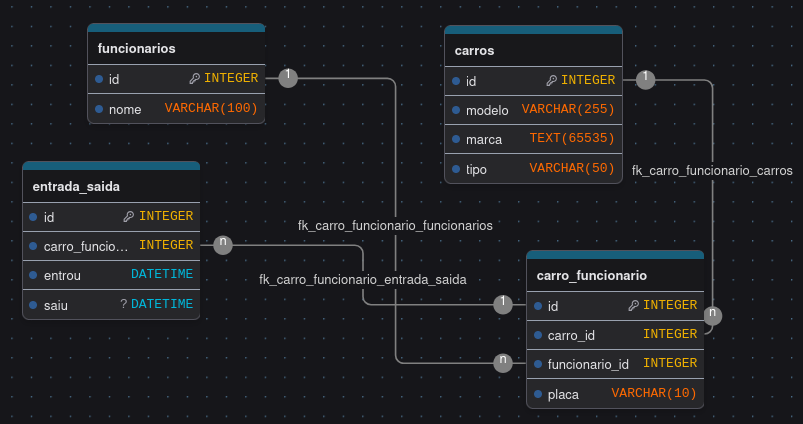

# Portaria Digital

### Trabalho de EAMT

___

### Feito por:
- Enzo Gnutzmann
- Gabriel Vieira
- Izabella Ramos
- Joao Paulo

### Banco De Dados:
*(Desenho feito com [DrawDB](https://www.drawdb.app/))*



## Filestructure
```
PortariaDigital/
├── node_modules/
├── database/
│   ├── controllers/
│   │   ├── carro_funcionarioController.js
│   │   ├── carrosController.js
│   │   ├── entrada_saidaController.js
│   │   └── funcionariosController.js
│   ├── databaseFile/
│   │   └── estacionamento_escolar.db
│   ├── createDatabase.js
│   └── DATABASE.js
├── public/
│   └── index.html
├── src/
│   └── index.js
├── package.json
└── README.md
```